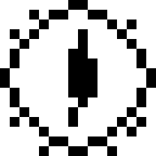
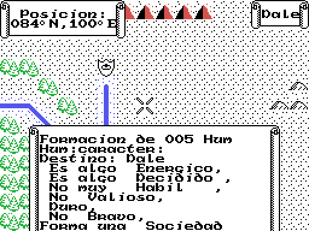
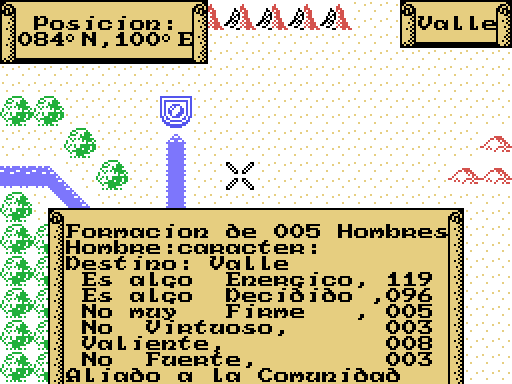
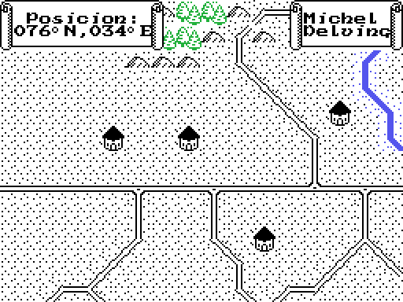
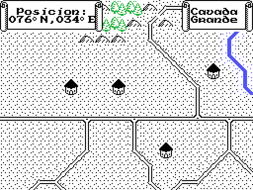
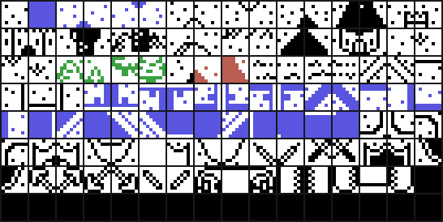
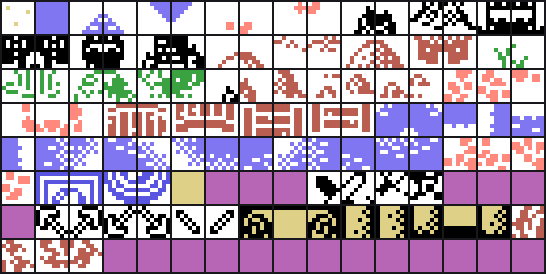

# War in Middle Earth (MSX) — el parche de Araubi

Araubi, en el foro, pidio tres cosas:

> Lo que mas interesante me parece seria poder hacer visibles a las unidades
> enemigas con algun parche, y un medidor de resistencia al anillo, mas poder
> ver los valores en cada apartado de las unidades.

Este repositorio sale del clon del desensamblado
(`antxiko/WarinMiddleEarth-MSX-disassembly`) y hereda sus herramientas. El
parche no toca los listados: parte de los cuerpos que `make extract` saca de la
cinta (`work/*.raw`), les aplica la tabla de `tools/parchea.py` y vuelve a
montar la cinta (`war_parche.tsx`). Cada cambio comprueba primero que los bytes
originales son los que espera; nada se desplaza (cada parche mide igual antes y
despues) y `make parche` avisa si algo cambia fuera de la tabla.

Todas las direcciones son de EJECUCION del bloque medio del juego (0x5E00, el
que corre desde 0x5E00) y estan tomadas del listado del desensamblado, no
supuestas. Las medidas en openMSX son sobre una Philips VG-8020 cargando la
cinta parcheada.

## Las imagenes de este documento NO son capturas de pantalla

Y no pueden serlo: el juego resube la pantalla al VDP sin parar, asi que **dos
fotos del MISMO estado separadas tres segundos ya salen con el 37 % de los
pixels distintos**. Comparar capturas, aqui, no demuestra nada.

Lo que se dibuja es el **bufer de pantalla del ZX Spectrum que el juego lleva en
RAM** -6.144 bytes de bitmap desde 0x4000 y 768 atributos desde 0x5800-, volcado
en un instante fijo y pintado despues con los colores que el propio cartucho le
asigna a cada atributo, su tabla de 0x0200. Ese bufer si esta quieto: dos
volcados separados quince segundos emulados salen iguales salvo 32 bytes, que
son el parpadeo del cursor.

Y el control que hacia falta: **dos pasadas del mismo estado dan una imagen
identica al pixel**, asi que lo que cambia entre "sin" y "con" lo cambia el
parche y nada mas. Vuelca `tools/omsx_zx.tcl`, dibuja `tools/render_zx.py`.

## El mapa de una unidad

El motor lleva **256 ranuras** de unidad, en arrays paralelos de 256 bytes
indexados por el numero de unidad (documentado en el desensamblado):

| direccion | que guarda |
|-----------|------------|
| `0xB900+n` | columna (X) en el mapa |
| `0xBA00+n` | fila (Y) en el mapa |
| `0xBB00+n`, `0xBC00+n` | el destino |
| `0xBD00+n` | tipo (nibble bajo), **bando (dos bits altos)** y banderas; **bit 4 = lleva el Anillo** |
| `0xC000+n` | nibble bajo = *Valioso*, nibble alto = *Habil* |
| `0xC100+n` | nibble bajo = *Duro*, nibble alto = *Bravo* |
| `0xC200+n` | *Energico* (byte entero; baja al andar) |
| `0xC300+n` | *Decidido* (byte entero; sube un mes si y otro tambien) |
| `0xC600+n` | estado · `0xC700+n` | pasos que quedan |

Las **tuyas** son las ranuras 0x00-0x77 salvo la 0x16 y la 0x17; las del
**otro bando** son la 0x16, la 0x17 y de la **0x78 en adelante** (`0x74EE
BUSCA_UNA_TUYA`, `0x7508 SIGUIENTE_DEL_ENEMIGO`). El **portador del Anillo** es
la primera ranura con el bit 4 de `0xBD00` puesto (`0x733E BUSCA_AL_PORTADOR`);
en una partida nueva es **Frodo, la unidad 0x05**.

---

## 1) Unidades enemigas visibles — HECHO y VERIFICADO

### Como esta hoy
El mapa vive en RAM desde `0xCC00`; en cada casilla, el **bit 7** del byte de
mapa significa "aqui hay alguien" y es lo que hace que `0x7708 PINTA_LA_UNIDAD`
dibuje la silueta de 2x2. Ese bit lo pone `RECENTRA_EL_MAPA` (0x7FAC): borra el
bit 7 de todo el mapa (`0x7FED`) y lo vuelve a sembrar unidad a unidad con el
bucle de `0x7FB2`. **Pero el bucle para en la unidad 0x78:**

```
0x7FB0  ld c,000h        ; empieza en la unidad 0
0x7FB2  ...              ; siembra el bit 7 de la casilla de la unidad C
0x7FCC  set 7,(hl)       ; "aqui hay alguien"
0x7FCE  inc c
0x7FCF  ld a,c
0x7FD0  cp 078h          ; <-- se para en 0x78
0x7FD2  jr nz,0x7FB2
```

Como las enemigas son de la 0x78 para arriba, **nunca se siembran, y por eso no
se dibujan**. Esa es la niebla de guerra del juego.

> **Aviso.** El interruptor por opcode de `0x8982`/`0x8993` sobre `0x8AF3` (mete
> `0xD0`=`ret nc` o `0xD8`=`ret c`) **no** decide la visibilidad del mapa: es el
> filtro de bando de `0x8AF1 SI_ES_ENEMIGO_LO_APUNTA`, que en la BATALLA busca
> un enemigo pegado en diagonal para atacarlo. Se comprobo antes de descartarlo.

### El cambio
Un solo byte: el tope del bucle, `0x78` -> `0x00`, en **0x7FD1**. Con `cp 000h`
el bucle recorre las 256 ranuras (0x00-0xFF) y siembra tambien las enemigas.
`0x7FC7` ya se salta las que estan en (0,0), asi que las ranuras vacias no
molestan.

### Verificado (openMSX, `tools/omsx_verifica.tcl`)
Arrancada una partida y forzado un disparo sobre el mapa (que dispara
`RECENTRA_EL_MAPA`), instrumentando `0x7FCC`:

```
sembradas en la ultima pasada = 254  (amigas<0x78 = 118, enemigas>=0x78 = 136)  indice maximo = 255
unidades enemigas (0x78-0xFF) con coordenadas en el mapa = 136
```

**136 unidades enemigas se siembran** donde antes se sembraban cero.

La misma casilla (036N/096E), sin el parche y con el:

| sin parche | con el primer parche |
|---|---|
|  |  |

Tres huestes de Sauron estan ahi mismo y no se dibujaba ninguna; con el parche
aparecen las tres siluetas, que son 34 unidades enemigas. Contado sobre el mapa
en RAM: **de 19 casillas con unidad se pasa a 28**, y en la pantalla cambian
**doce celdas de caracter**, o sea tres dibujos de dos por dos y nada mas.

Esa medida de doce celdas es de aquella pareja, la del primer parche, y por eso
se conserva aqui: aisla el cambio de la siembra y nada mas. Contra la cinta de
hoy no se puede medir asi, porque el mapa viene repintado entero -735 de las 768
celdas y 560 atributos cambian- y la cuenta ya no separaria una cosa de la otra.

| sin parche | la cinta de hoy |
|---|---|
|  |  |

### El limite: dos enemigas se quedan fuera

El bucle se salta **a proposito** las unidades 0x16 y 0x17 (`cp 016h` y
`cp 017h` en 0x7FB3), y eso el parche no lo toca. Al empezar la partida hay
**diez casillas** con enemigos dentro y el parche siembra **nueve**: la
(111,64), donde solo esta la 0x16, sigue sin dibujarse. La 0x17 si sale, pero
porque comparte casilla -la (65,54)- con otras treinta y seis.

---

## 2) Los valores de cada apartado de la unidad — HECHO y VERIFICADO

### Como esta hoy
Al mirar una unidad, `0x6F0B FICHA_DE_LA_UNIDAD` arma su ficha en el buffer
`0x7C17` (24 columnas x 10 filas) y la pinta. `0x6FDC LAS_SEIS_CUALIDADES`
escribe seis apartados, cada uno como **adverbio + adjetivo** ("Muy Valioso",
"Es algo Bravo"...), eligiendo el adverbio por tramos con `0x6E88`. El numero
que hay debajo **no se ve**:

| apartado | fuente | rango |
|----------|--------|-------|
| Valioso  | `0xC000+n` nibble bajo | 0-15 |
| Habil    | `0xC000+n` nibble alto | 0-15 |
| Duro     | `0xC100+n` nibble bajo | 0-15 |
| Bravo    | `0xC100+n` nibble alto | 0-15 |
| Energico | `0xC200+n` byte | 0-255 |
| Decidido | `0xC300+n` byte | 0-255 |

### El cambio
El juego ya trae `0x7113 ESCRIBE_A_EN_TRES_CIFRAS` (A -> tres digitos en (HL)).
El parche anade una rutina, **`MUESTRA_LOS_VALORES`** (`src/parche/ficha_valores.asm`,
76 bytes), que lee los seis valores de la unidad de la ficha y los escribe en
cifras en la **columna 20** de cada fila del buffer. Vive en **0x6600**, encima
del **motor del altavoz del ZX Spectrum, que en esta conversion no lo llama
nadie** (los efectos acaban en el `ret` de 0x65FF): zona muerta reutilizable.

La engancha un **trampolin** en `0x708A`: donde `ARMA_LA_FICHA` hacia
`ld hl,0x5FBD` justo antes de pintar, ahora hace `call 0x6600`; la rutina
escribe los numeros y termina rehaciendo ese `ld hl,0x5FBD`, de modo que el
render sigue igual.

### Verificado (openMSX, `tools/omsx_ficha.tcl`)
Forzando la ficha de Frodo (unidad 0x05) y comparando los digitos escritos con
los valores reales:

```
valores reales de la unidad 0x05:
  Valioso=10  Habil=7  Duro=7  Bravo=2  Energico=126  Decidido/Anillo=176
Energico -> digitos en la ficha: '126'  (esperado 126)
Decidido -> digitos en la ficha: '176'  (esperado 176)
Habil    -> digitos en la ficha: '007'  (esperado 007)
Valioso  -> digitos en la ficha: '010'  (esperado 010)
Duro     -> digitos en la ficha: '007'  (esperado 007)
Bravo    -> digitos en la ficha: '002'  (esperado 002)
```

Los seis coinciden. Por el camino normal del juego (cursor sobre una unidad) la
ficha sale con sus numeros: `docs/imagenes/ficha_con_valores.png` (Gandalf,
"Energico 198, Muy Decidido 192, Es algo Bravo 006"...).

---

## 3) El plazo del Anillo — HECHO y VERIFICADO

### Lo que se entendio mal la primera vez

La primera version de este documento decia que "la corrupcion **es** el contador
0xC300 del portador, y con el parche 2 ya se ve". Es verdad que 0xC300 sube un
punto al mes, pero **no es lo que mata**, y no era lo que se pedia. Lo que se
pedia es ver **cuanto le queda al portador antes de sucumbir**.

### Lo que dice el binario

El reloj del juego (0x831B) cuenta tics, dias y meses. Al pasar del dia 60 al 61:

```
8332  ld a,000h      ; el operando de 0x8333 es la CUENTA ATRAS de meses
8334  dec a          ; 0x7F4F la deja en 255 al empezar la partida
8335  ld (08333h),a  ; un mes menos de plazo
8338  jp z,DERROTA   ; a cero, la pantalla de Sauron
833b  ...
8340  ld hl,0853ah   ; y el mensaje de ese mes: "El Anillo corrompe al que lo usa."
```

O sea: **el operando de 0x8333 es, literalmente, los meses que quedan antes de
perder la partida**, y el juego lo ata al Anillo con su propio mensaje. Empieza
en 255 y no se ensena en ningun sitio.

Hay mas caminos a `DERROTA` -quedarse sin portador, agotar los usos de 0xC000 en
la batalla, entregar el Anillo a una unidad sin usos-, pero ese es el unico que
es un **plazo**.

### El cambio

`MARCA_AL_PORTADOR` (0x6F6E) mira el bit 4 de 0xBD00 y, si esa unidad lleva el
Anillo, escribe el caracter 0x5F -el anillo- en **0x7C46**, la ultima columna de
la segunda fila de la ficha. A su izquierda, 0x7C43, hay tres columnas libres:
justo tres cifras.

Donde el juego hacia `ld a,05fh` + `ld (07c46h),a`, ahora llama a
**ANILLO_CON_PLAZO (0x666E)**, que pone el anillo igual y ademas escribe el
0x8333 en 0x7C43 con `ESCRIBE_A_EN_TRES_CIFRAS` (0x7113), la misma rutina que la
ficha ya usaba dos lineas antes.

**Y guarda BC, DE y HL.** Lo que va detras en la ficha es
`call DESCRIBE_EL_DESTINO` (0x6F7C), que se aprovecha del HL que traia de antes
-0x7C27, donde lo dejo el `ESCRIBE_A_EN_TRES_CIFRAS` de 0x6F6B-. Llamar a esa
misma rutina aqui sin guardarlo deja la ficha escrita en otro sitio: sale con
los nombres de media Comunidad encima. Probado, y se ve.

### Verificado (openMSX)

La ficha de **Frodo**, el portador, con el parche:


```
Frodo
Hobbit                255o     <- el plazo, pegado al anillo
Destino: Rivendell
  Es algo Energico,     126
  Es muy Decidido ,     176
  ...
```

`0x8333` en RAM vale 255 en ese instante, y 255 es lo que sale escrito. Sin
parche, esa misma ficha (`docs/imagenes/ficha_frodo_sin_parche.png`) solo dice
"Es muy Decidido," y el anillo, sin numero ninguno.

Solo aparece en la ficha del portador, que es donde el juego dibuja el anillo.

---

## 4) El Ojo de Sauron para las enemigas — HECHO y VERIFICADO

Con el parche 1 las enemigas ya salian... **con el casco de las tuyas**, que es
media solucion: las ves, pero no sabes cuales son. El icono nuevo -el Ojo de
Sauron, 16x16 en blanco y negro- lo dibujo Antxiko, y aqui esta metido en el
cartucho.

### Por que no era inmediato

El juego elige el dibujo de una casilla mirando **solo el byte del mapa**:

```
PINTA_LA_UNIDAD (0x7708):   or a          ; sin el bit 7 no hay nada
                            ret p
                            bit 6,a       ; casilla con una orden en marcha -> 0x11
                            ld a,011h
                            jr nz,ESTAMPA
                            ld a,015h     ; si no, el dibujo de siempre
```

Al dibujar no sabe de que bando es la unidad. Hay que metrselo en el propio byte
de mapa, y para eso hace falta un bit libre.

### Los tres huecos que si estaban libres

- **El bit 5 del byte de mapa.** Medido sobre las 13.260 casillas: **cero usos**.
  (El bit 6 lo usa el juego para "casilla con una orden en marcha" y el 7 es
  "aqui hay alguien".)
- **Los tiles 111 a 127 de la tabla de 0x9E00**, que estan a cero. Cada tile son
  nueve bytes: ocho de dibujo y el atributo del ZX detras. Se usan cuatro.
- **La zona muerta de 0x664C**, detras de la rutina de los valores: mas motor de
  altavoz que no llama nadie.

### El hueco que NO estaba libre, aunque lo pareciera

La tabla de cuadros de dos por dos de **0x77B5** tiene seis entradas a cero
(0x00, 0x01, 0x03, 0x04, 0x05 y 0x06) y parecen sitio de sobra. **No lo son:**
`PINTA_LO_DE_ENCIMA` (0x7714) elige entrada con un `and 00fh` sobre el nibble
bajo del terreno, asi que los indices 0x00-0x0F ya tienen dueno. Poner el Ojo en
el hueco 0x03 se lo puso a las **447 casillas de terreno de tipo 3**. Se probo,
se vio, y se tiro.

La salida: no usar indice. `DIBUJO_SEGUN_BANDO` pone HL en una lista propia de
cuatro codigos y entra en `ESTAMPA_DOS_POR_DOS` **pasada su aritmetica**, en
0x7720, que es justo donde esa rutina hace el primer `ld a,(hl)`.

### El cambio

| donde | que |
|---|---|
| 0x7FC9 | `call CELDA_DEL_MAPA` + `set 7,(hl)` pasa a ser `call SIEMBRA_CON_BANDO` |
| 0x770A | el cuerpo de `PINTA_LA_UNIDAD` pasa a ser `jp DIBUJO_SEGUN_BANDO` |
| 0x664C | las tres rutinas nuevas, 61 bytes (`src/parche/icono_enemigo.asm`) |
| 0xA1E7 | los cuatro tiles del Ojo, 36 bytes, en los indices 111 a 114 |

`SIEMBRA_CON_BANDO` pone el bit 7 como siempre y, si la unidad es la 0x78 o
mayor, tambien el bit 5. `DIBUJO_SEGUN_BANDO` mira ese bit 5 antes que nada.

### Verificado (openMSX)

| el primer parche: enemigas con casco | ahora: el Ojo de Sauron |
|---|---|
|  |  |

- **nueve casillas** llevan el bit 5, y son las nueve que tienen enemigos
  dentro; **cero** casillas amigas lo llevan;
- en la pantalla cambian **doce celdas de caracter** -las tres huestes- y **cero
  atributos de color**: el Ojo tapaba el fondo igual que el casco, con la misma
  tinta negra sobre papel blanco (asi era entonces; al repintar el mapa cada uno
  se llevo su color, y por eso los dos dibujos de mas abajo ya no son estos);
- los dos aliados de la esquina siguen con su casco.

El icono, ampliado y releido de la cinta ya parcheada:

| la unidad aliada (tiles 81-84) | la enemiga (tiles 111-114) |
|---|---|
|  |  |

**El color del ZX va por celda de 8x8, no por pixel**, asi que el Ojo solo puede
tener dos colores por cuadrante. Al repintar el mapa se le dieron: **rojo oscuro
sobre el crema del terreno** -atributo 0x3A, y 0x17 en el cuadrante de arriba a
la izquierda, que va al reves-, y el icono aliado paso a ser un **escudo azul**.
Antes los dos llevaban el mismo 0x38, negro sobre blanco, y a distancia se
parecian demasiado. Las dos imagenes de arriba son ya las de la cinta de hoy.

---

## 5) Los textos en espanol — HECHO y VERIFICADO

La conversion de Animagic tradujo el juego a medias: los **toponimos del mapa**
se quedaron en ingles y **tres nombres de raza** salen truncados. Aqui van los
diecinueve cambios, con los nombres de la traduccion de Tolkien al castellano.

### Los cuatro formatos de texto del juego

Esto es lo que decide que se puede cambiar y que no. Ninguna cadena puede
cambiar el numero de bytes que ocupa (el parche no desplaza nada), pero cada
formato aprieta de una manera distinta:

**a) La tabla de SITIOS, 0x7A5E.** La recorre `BUSCA_EL_SITIO` (0x6E50). Cada
registro es

```
[x][y][2 + ancho*filas][ancho<<4 | filas][texto]
```

sin terminador: el largo sale del tercer byte, que ademas es lo que hay que
sumar para llegar al registro siguiente. El cuarto byte es el **tamano del
cartel** que dibuja `VENTANA_DEL_SITIO` (0x6E2D), y el texto lo rellena entero,
fila a fila. Por eso "Minas Tirith" son doce letras en 6x2 y "Monte   Gundabad"
dieciseis en 8x2, con los espacios puestos a mano. Un toponimo nuevo tiene que
medir **exactamente ancho x filas**.

**b) Las LISTAS de cadenas pegadas**, con el **bit 7 en la ultima letra**. Se
llega a la cadena numero N contando terminadores desde la base
(`SALTA_B_TEXTOS`, 0x6E98). Hay cuatro: razas en plural (0x7D06), razas en
singular (0x7D39), carteles de bando (0x7D6A) y adverbios (0x7D9A). Dentro de
una lista **las cadenas si pueden cambiar de largo**, mientras el total no
cambie: es lo que permite pagar "Hombre" con lo que sobra de "Brujo". El total
es intocable porque la base de la lista siguiente es una direccion fija del
codigo.

**c) La lista de los 24 NOMBRES propios, 0x6B46**, separados por `0xB7` y
copiados hasta ese separador (0x6E23 y 0x6F38).

**d) Los SEIS ADJETIVOS de la ficha, cada uno con su `ld hl`.** Estos no estan
en ninguna lista que haya que recorrer: 0x704B, 0x7061, 0x7006, 0x6FEF, 0x701E y
0x7035 cargan cada uno su direccion absoluta. Son los unicos que **si pueden
crecer**, moviendolos a otro sitio y cambiando el puntero. El limite aqui no es
la cinta sino la pantalla: la ficha son 24 columnas, el numero del parche va en
la 20 y el adverbio mas largo (" No es muy ") mide once, asi que un adjetivo de
ocho letras deja la coma justo debajo del numero -es lo que ya le pasaba a
"Energico"-. Lo mismo vale para la lista de la fila 9 (0x7D6A), que se ha mudado
entera a 0x66A2 con la frase completa en cada entrada.

### Los diecinueve cambios

| # | direccion | como estaba | como queda | cabe porque |
|---|-----------|-------------|------------|-------------|
| 1 | `0x7B34` | Bywater | **Delagua** | 7x1, siete letras justas |
| 2 | `0x7B28` | Buckland | **LosGamos** | 8x1, ocho justas |
| 3 | `0x7B5D` | Far Downs | **Quebradas** | 9x1, nueve justas |
| 4 | `0x7B4B` | Michel Delving | **Cavada Grande** | 7x2: `Cavada ` + `Grande ` |
| 5 | `0x7BC7` | Grey  Havens | **Ptos  Grises** | 6x2: `Ptos  ` + `Grises` |
| 6 | `0x7AA5` | Rivendell | **Rivendel** | de 9x1 a 8x1: le sobra una letra |
| 7 | `0x7AB2` | Isenmouthe | **Ga. Hierro** | 10x1, diez justas |
| 8 | `0x7A79` | Morannon | **Puerta N** | 8x1, ocho justas |
| 9 | `0x7B0D` | Dale | **Valle** | de 4x1 a 5x1, con el byte que le presta Rivendel |
| 10 | `0x7B7F` | HelmsDeep | **AbismHelm** | 5x2: `Abism` + `Helm ` |
| 11 | `0x6BA5` | Brand III | **Bardo III** | nueve letras entre dos `0xB7` |
| 12 | `0x7D3A`, `0x7D07` | Brujo / Brujos | **Mago / Magos** | ver abajo |
| 13 | `0x7D3A` | Elf | **Elfo** | ver abajo |
| 14 | `0x7D3A`, `0x7D07` | Hum | **Hombre / Hombres** | ver abajo |
| 15 | `0x7DE6` | Habil | **Firme** | cinco letras por cinco, en su hueco |
| 16 | `0x6689` | Valioso | **Virtuoso** | se muda al motor de altavoz muerto |
| 17 | `0x6692` | Duro | **Valiente** | idem |
| 18 | `0x669B` | Bravo | **Fuerte** | idem |
| 19 | `0x66A2` | Aliado a la Sociedad | **Aliado a la Comunidad** | la lista de la fila 9, mudada entera |

Los diez primeros son la tabla de sitios; el 11 es la lista de los 24 nombres
propios (es el numero 13, entre `Thranduil` y `Theodred`); del 15 al 18 son
adjetivos de la ficha, que no van en ninguna lista -a cada uno lo carga su
propio `ld hl` absoluto: 0x704B, 0x7061, 0x7006, 0x6FEF, 0x701E y 0x7035-, y por
eso pueden crecer moviendolos y cambiando el puntero. El 19 es la ultima linea
de la ficha, que se componia con una plantilla mas una palabra: ahora cada
entrada de la lista trae la frase entera y se escribe desde la columna 0.

### Las dos tablas de razas: la cuenta que las hace caber

"Hum" -> "Hombre" son **tres bytes mas** y "Elf" -> "Elfo" **uno mas**. No hay
sitio detras: en 0x7D6A empieza la lista de carteles de bando y el codigo entra
ahi por direccion fija. Pero **"Brujo " -> "Mago" son dos bytes menos, y "Brujo"
sale dos veces en cada lista** (las razas 0 y 7 son dos clases de mago). La
cuenta sale exacta, sin tocar un solo byte fuera:

```
singular (0x7D3A, 44 bytes, razas 0..8)
  Brujo·6 Nazgul·6 Hum·3 Elf·3 Enano·5 Orc·3 Hobbit·6 Brujo·6 Gollum·6  = 44
  Mago·4  Nazgul·6 Hombre·6 Elfo·4 Enano·5 Orc·3 Hobbit·6 Mago·4 Gollum·6 = 44

plural (0x7D07, 45 bytes, razas 0..7)
  Brujos·7 Nazgul·6 Hum·3 Elfos·5 Enanos·7 Orcs·4 Hobbits·7 Brujo·6 = 45
  Magos·5  Nazgul·6 Hombres·7 Elfos·5 Enanos·7 Orcs·4 Hobbits·7 Mago·4 = 45
```

`Gollum` cierra las dos listas y no se toca, porque su ultimo byte **es** la base
de la lista siguiente.

> **Lo que va mas alla de la lista literal.** Los tres cambios de raza se pidieron
> en singular ("Brujo -> Mago", "Elf -> Elfo", "Hum -> Hombre"), pero `Brujo` y
> `Hum` estan **en las dos tablas**: dejar solo la de singular hubiera dejado el
> juego diciendo "Formacion de 005 Hum". Se ha cambiado tambien la de plural,
> **con la forma plural** (`Magos`, `Hombres`), que es lo que ese sitio pide:
> sus vecinas son `Enanos`, `Orcs` y `Hobbits`. `Elfos` ya estaba bien y no se
> toca. La raza 7 de la tabla de plurales la escribio el juego en singular
> (`Brujo `), y se respeta: queda `Mago`.

### Que no se ha tocado

- **`Orthanc`, `Orodruin`, `Barad-Dur`, `Umbar`, `Edoras`, `Linhir`,
  `Pelargir`, `Minas Tirith`, `Minas Morgul`, `Dol Guldur`, `Dol Amroth`,
  `Cirith Ungol`, `Durthang`, `Monte Gundabad`, `Harlond`, `Bree`, `Fornost`,
  `Hobbiton`, `Tharbad`**: no estaban en la lista, y ademas se escriben igual (o
  casi) en castellano.
- **Los otros cinco adjetivos** de la ficha (Energico, Decidido, Habil, Duro,
  Bravo) y los siete adverbios.
- **`Nazgul`**, que ya estaba bien (sin el circunflejo, que la fuente no tiene).

### Verificado (openMSX)

La cinta parcheada se carga entera en una Philips VG-8020
(`tools/omsx_arranque.tcl`) y se leen las tablas **de la RAM de la maquina**,
recorriendolas como las recorre el Z80. Los **29 registros de sitio siguen
midiendo ancho x filas**, y las listas de detras de las tocadas se siguen
leyendo enteras, que es la prueba de que nada se ha desplazado:

```
RAZAS EN PLURAL   (0x7D06): Magos, Nazgul, Hombres, Elfos, Enanos, Orcs, Hobbits, Mago, Gollum
RAZAS EN SINGULAR (0x7D39): Mago, Nazgul, Hombre, Elfo, Enano, Orc, Hobbit, Mago, Gollum, Mujer
FILA 9 DE LA FICHA (0x66A2): Aliado a la Comunidad, Forma una -, Forma una  union, Forma una  union
ADVERBIOS         (0x7D9A): Realmente ,  Muy ,  Es muy,  ,  Es algo ,  No muy  ,  No
ADJETIVOS (por sus seis ld hl): Energico, Decidido, Firme, Virtuoso, Valiente, Fuerte
NOMBRES (0x6B46): ... Thranduil, Bardo III, Theodred ...
```

Y en pantalla, la **misma casilla y la misma unidad** con la cinta original y con
la parcheada -la formacion 0x39, cinco Hombres en Valle-:

| sin parche | con parche |
|---|---|
|  |  |

De un tiron: el cartel `Dale` -> `Valle`, `Formacion de 005 Hum` ->
`005 Hombres`, `Hum:caracter:` -> `Hombre:caracter:`, `Destino: Dale` ->
`Destino: Valle` y `No Valioso` -> `No Virtuoso`. La de la derecha es la cinta de
hoy, asi que trae ademas el mapa repintado y el papel khaki: contra la original
cambian **547 de las 768 celdas**, y ya no tiene sentido contarlas para medir el
texto.

Y el cartel de dos filas, que era el que podia romperse:

| sin parche | con parche |
|---|---|
|  |  |

`Michel`/`Delving` pasa a `Cavada`/`Grande` en el mismo cartel de 7x2. Cuando se
midio contra la cinta de septiembre eran **13 celdas de caracter, todas dentro
del cartel**, y ningun atributo; la de hoy trae tambien el mapa repintado
debajo.

Las imagenes son las de siempre: el bufer de pantalla del ZX volcado de la RAM
en un instante fijo y dibujado con `tools/render_zx.py`, no capturas.

---

## 6) El mapa repintado — HECHO y VERIFICADO

El mapa se dibuja con **128 tiles de 8x8** en 0x9E00, de nueve bytes cada uno:
ocho de dibujo y un **atributo del ZX Spectrum** detras. `tools/lienzos.py` los
saca a un PNG de 128x64 a tamano real -dieciseis por fila- y los vuelve a leer;
`make parche` compara el lienzo con la cinta y convierte en entrada cada dibujo
que haya cambiado. **122 de los 128** han cambiado: 103 entradas y 848 bytes.

### El lienzo mentia: el atributo es del ZX, el color es del MSX

Los tiles salian al PNG con los colores del **Spectrum**, que es lo que dice el
atributo. En pantalla no se ven asi nunca: esta conversion no manda el atributo
al VDP, lo traduce antes `ATRIBUTO_A_COLOR` (0x049F), leido de la cinta:

```
049F  push hl / push de / push bc / push af
04A3  ld hl,004CEh        ; la tabla SIN brillo
04A6  bit 6,a             ; el BRIGHT del atributo
04A8  jr z,+3
04AA  ld hl,004D6h        ; la tabla CON brillo
...                       ; tinta -> nibble alto, papel -> nibble bajo
```

| | 0 | 1 | 2 | 3 | 4 | 5 | 6 | 7 |
|---|---|---|---|---|---|---|---|---|
| `0x04CE`, sin brillo | 1 | 4 | 6 | 13 | 12 | 7 | 10 | 15 |
| `0x04D6`, con brillo | 1 | 5 | 9 | 13 | 3 | 7 | 11 | 15 |

Dieciseis huecos y **doce colores distintos del MSX**: no hay atributo que de el
rojo medio (8), el verde medio (2) ni el gris (14). Medido sobre el repintado que
llego: 349 pixeles de rojo medio en 16 tiles, 47 de verde medio en 4 y 3 de gris
en uno; cada uno se cambia por el alcanzable mas parecido y la herramienta lo
dice. Y solo cuatro de los ocho colores cambian con el bit de brillo -azul,
rojo, verde y amarillo-, asi que la regla de "los dos del mismo brillo" solo
obliga en esos.

### El papel del texto, del blanco al khaki

`UN_CARACTER_NORMAL` (0x7616) pinta **todos** los caracteres de la fuente con un
atributo fijo, el `ld a,078h` de 0x763E. Su operando -0x763F- pasa de 0x78 a
0x70: papel 6 con brillo, que la tabla de 0x04D6 manda al color 11 del MSX, el
mismo khaki de los marcos. Se lleva tambien los **espacios**, que son los que
rellenan el interior de un cartel. Es global: menu, rotulos, ficha y batalla.

### Verificado (openMSX)

La cinta parcheada cargada de cero en un Philips VG-8020, volcado el bufer de
pantalla del ZX en la misma casilla de siempre (036N/096E):

- los bytes del parche siguen en su sitio en el mismo volcado (0x7FD1=00,
  0x708A=CD, 0x664C=CD), que es el control de que el juego esta donde se cree;
- contra la cinta original cambian **735 de las 768 celdas** de caracter y 560
  atributos;
- y el previo que `tools/previo_repinta.py` habia dibujado ANTES de tocar la
  cinta sale **identico al pixel**: 0 de 196.608 distintos.

| sin parche | con el mapa repintado |
|---|---|
|  |  |

Los 128 tiles, como vienen en la cinta y como quedan:

| la cinta | repintados |
|---|---|
|  |  |

**Ocho tiles se quedan en blanco a proposito**: el 85 al 88 y el 93 al 96, que
son los cuatro cuadrantes de los cuadros 0x16 y 0x18 de la tabla de 0x77B5. De
esa tabla tienen dueno conocido el 0x00-0x0F (`PINTA_LO_DE_ENCIMA`, por el
nibble del terreno), el 0x11 y el 0x15 (`PINTA_LA_UNIDAD`) y el 0x13/0x14
(terreno 4); para el 0x10, el 0x12, el 0x16, el 0x17 y el 0x18 **no se ha
encontrado llamador**, que no es lo mismo que demostrar que estan muertos.

## Estado

| peticion | estado | evidencia |
|----------|--------|-----------|
| 1 · enemigos visibles | hecho, verificado | 136 enemigas sembradas; 9 casillas de 10 (la 0x16 y la 0x17 las salta el juego) |
| 2 · valores de la unidad | hecho, verificado | los seis numeros coinciden con la RAM |
| 3 · plazo del Anillo | hecho, verificado | el 0x8333 -255 meses- escrito al lado del anillo |
| 4 · el Ojo de Sauron | hecho, verificado | 9 casillas marcadas, 12 celdas cambian, 0 atributos tocados |
| 5 · los textos en espanol | hecho, verificado | leidos de la RAM del emulador: 29 carteles cuadran, las cuatro listas se siguen leyendo |
| 6 · el mapa repintado | hecho, verificado | 122 de 128 tiles; volcado de la cinta parcheada = previo, 0 pixeles distintos de 196.608 |

**1.396 bytes en 130 entradas de la tabla, ninguna fuera de ella y ninguna
desplazada**: 27 escritas a mano (548 bytes de codigo, punteros y texto) y 103
sacadas de los lienzos (848 de tiles repintados). `make test` = 79 en verde.

## Como se reparte

`make ips` saca **`war_parche.ips`**, que lleva solo los bytes que cambian -1.515
en 39 registros, 1.718 bytes de fichero- y se aplica sobre tu propia cinta.
Comprobado: aplicado sobre `war.tsx` da un fichero identico byte a byte al que
saca `make parche`.

## Lo que queda abierto

- **Nadie ha jugado una partida entera** con el mapa repintado; Araubi si jugo
  una con la version de septiembre, y de ahi salio el fallo del gancho del
  Anillo. La ficha se ha visto en Gandalf y en Frodo, no en todos los tipos de
  unidad.
- **Ocho tiles se quedan en blanco**: el 85 al 88 y el 93 al 96, que son los
  cuadros 0x16 y 0x18 de la tabla de 0x77B5. No se les ha encontrado llamador,
  que no es lo mismo que demostrar que estan muertos.
- **El plazo solo se ve abriendo la ficha del portador.** Un medidor siempre en
  pantalla pide enganchar el bucle de partida (0x7F57) y escribir cada cuadro:
  es codigo nuevo con mas riesgo, y queda apuntado como ampliacion.
- **Las unidades 0x16 y 0x17 siguen invisibles**, porque el bucle de siembra las
  salta a proposito y no se ha averiguado por que.
