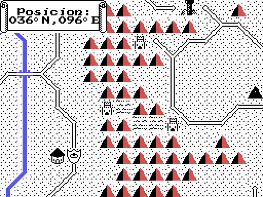
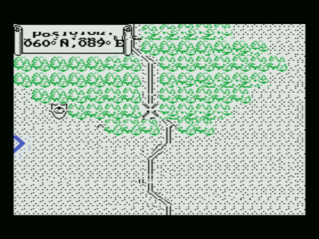
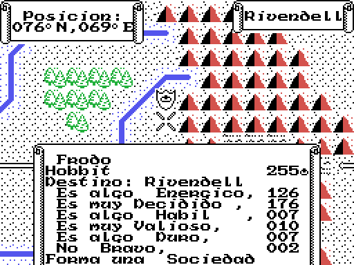
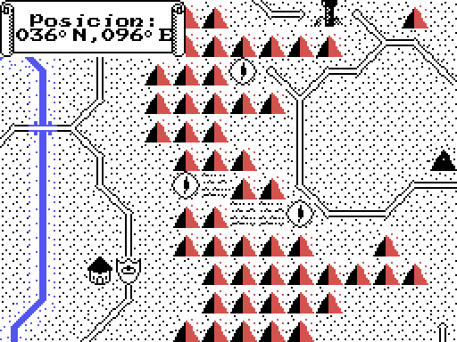

# War in Middle Earth (MSX) — Araubi's patch

> ## Playable, and not finished
>
> Everything below is in place and measured in openMSX, but **nobody has played
> a whole game with the patch on**. What is known to be missing is listed at the
> bottom. Read it before you judge a screenshot.

A byte patch for the MSX cassette of **War in Middle Earth** (Melbourne House /
Dro Soft, 1989), built on top of the
[commented disassembly](https://github.com/antxiko/WarinMiddleEarth-MSX-disassembly).
It does the three things **Araubi** asked for on the forum: make enemy units
visible, show the numeric value of each of a unit's attributes, and surface how
long the Ring-bearer has left. Plus a fourth: the enemy now has an icon of its
own, so you can tell the two sides apart.

[README en español](README.es.md) · Full write-up: [INVESTIGACION.md](INVESTIGACION.md)

## The tape is not here

No cassette image is distributed, only the patch work (see
[LEGAL-NOTICE.md](LEGAL-NOTICE.md)). You supply your own `war.tsx` (sha256
`13c63632…b1d81208`), and:

    make extract     # pulls the block bodies out of your tape into work/
    make parche      # applies the table and writes war_parche.tsx
    make ips         # and war_parche.ips, the patch on its own
    make test        # the checks

**`war_parche.ips` is in this repository**: it carries only the bytes that
change — our own code and the drawing of the Eye — so you can apply it to your
own cassette with any IPS tool, or with `python3 tools/ips.py --aplica war.tsx
war_parche.ips war_parche.tsx`.

`war_parche.tsx` is the patched cassette, the same size as the original, ready
for a real MSX1 (`openmsx -machine Philips_VG_8020 -cassetteplayer war_parche.tsx`).

## What it changes

Everything is in the game's middle block (which runs at `0x5E00`) plus four
tiles in the high block, **197 bytes across seven edits**. Each one is checked
against the bytes it expects before writing — nothing shifts, and `make parche`
fails if a single byte changes outside the table (`tools/parchea.py`).

**1 · Enemy units become visible.** The map keeps a "someone is here" bit for
each cell, and `RECENTRA_EL_MAPA` (0x7FAC) re-plants it unit by unit — but its
loop stops at unit `0x78`, exactly where the enemy side begins, so the enemy is
never planted and never drawn. Changing the loop's limit from `0x78` to `0x00`
(**one byte, at 0x7FD1**) makes it walk all 256 units. Verified: **136 enemy
units get planted where zero did before.**

| without the patch | with it |
|---|---|
|  |  |

**2 · Every attribute shows its number.** A unit's sheet lists six qualities —
Valioso, Habil, Duro, Bravo, Energico, Decidido — as adverb + adjective ("very
brave"), never as a number. A new routine (`MUESTRA_LOS_VALORES`, 76 bytes),
written over the **ZX Spectrum beeper engine at 0x6600 that nothing in this port
ever calls**, reads the six values (from `0xC000`/`0xC100`/`0xC200`/`0xC300`) and
prints them as digits in the sheet. It is hooked by a three-byte trampoline at
`0x708A`. Verified against the real values: all six match.

**3 · The Ring-bearer's deadline, next to the ring.** The game's clock counts
ticks, days and months; every month it decrements the operand at **0x8333** — set
to 255 when the game starts — prints *"El Anillo corrompe al que lo usa"*, and
`jp z,DERROTA`. That operand is literally how long you have left, and the game
never shows it. `MARCA_AL_PORTADOR` draws the ring character at 0x7C46, the last
column of the sheet's second row; the three columns to its left were free, and
that is where the number now goes.

**4 · The enemy gets the Eye of Sauron.** With change 1 the enemy showed up
wearing *your* helmet, which is half a fix. The drawing routine only ever looks
at the map byte, so it cannot know which side a unit belongs to — but **bit 5 of
that byte was free** (measured: zero uses across all 13,260 cells). It now marks
"this one is theirs", and four new tiles at the tail of the 0x9E00 table (111 to
114, which were all zeros) hold the icon.

| enemies with your helmet | enemies with the Eye |
|---|---|
|  |  |

None of the images above are screen captures: the game re-uploads the screen to
the VDP constantly, so two photographs of the *same* state, three seconds apart,
already differ in 37 % of their pixels. They are drawn from the ZX screen buffer
the game keeps in RAM, dumped at a fixed instant. Full evidence, addresses and
the openMSX output are in [INVESTIGACION.md](INVESTIGACION.md).

## What is still missing

- **Nobody has played a full game** with the patch on.
- The unit sheet has been seen for a formation leader (Gandalf) and for the
  Ring-bearer (Frodo); **not every unit type has been checked** for the number
  colliding with a long label.
- **The deadline only shows inside the bearer's sheet.** A permanent counter on
  the play screen would mean hooking the game loop (0x7F57) and writing every
  frame: new code, more risk, left as an extension.
- **Units 0x16 and 0x17 stay invisible.** The planting loop skips them on
  purpose (`cp 016h` / `cp 017h` at 0x7FB3) and we have not worked out why. Nine
  of the ten occupied enemy cells get planted; the tenth holds only unit 0x16.

## Licence

The tools, the write-up and the IPS patch are released under [LICENSE](LICENSE).
**The game is not**, and no cassette image is distributed here — see
[LEGAL-NOTICE.md](LEGAL-NOTICE.md).
